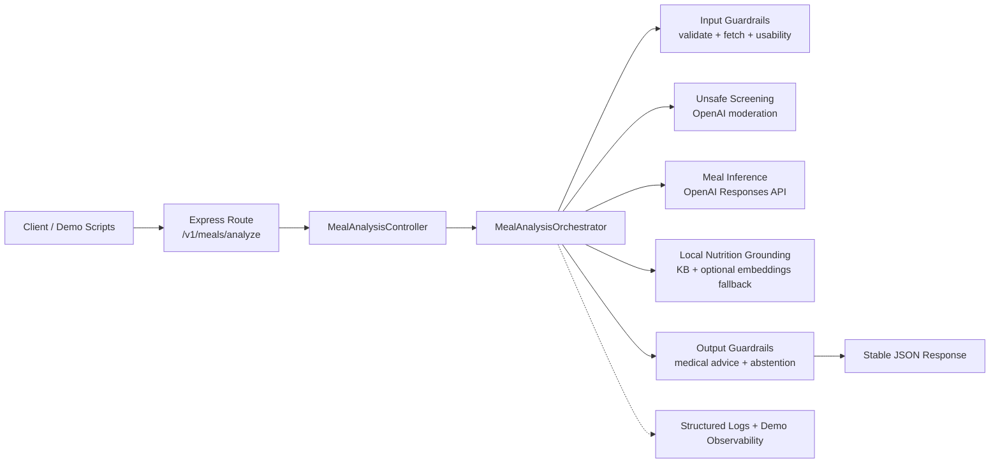
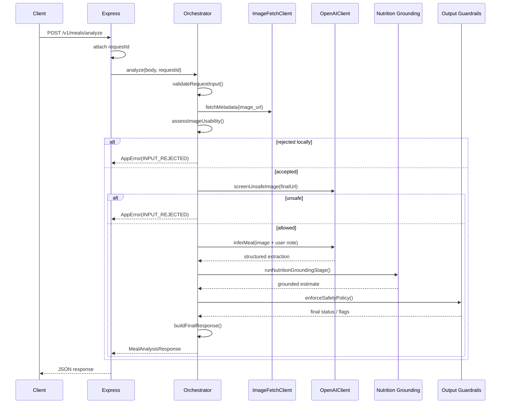

# Architecture Review

## Purpose

This document is written for a technical enablement presentation. It is grounded in the current repository implementation and explicitly separates:

- current implementation in this repo
- recommended production-ready design for the assignment

## Current Implementation

### What the repo implements today

The repo currently exposes two HTTP routes:

- `POST /v1/meals/analyze`: the current MVP meal-analysis path
- `POST /v1/meals/extract`: an older extraction-only path that still exists in the app but is not the main MVP flow

The meal-analysis MVP is built as a deterministic Express pipeline with these logical stages:

1. input guardrails
2. unsafe screening
3. meal inference
4. nutrition grounding
5. output guardrails
6. response shaping

The main wiring lives in:

- `src/app.ts`
- `src/pipeline/orchestrator/mealAnalysisOrchestrator.ts`
- `src/controllers/mealAnalysisController.ts`
- `src/routes/mealAnalysisRoutes.ts`

### End-to-end request flow

1. `requestContextMiddleware` assigns or propagates `requestId` and start time.
2. `MealAnalysisController.analyzeMeal()` forwards the request body to the orchestrator.
3. `MealAnalysisOrchestrator.analyze()` validates input, fetches the image, performs unsafe screening, calls the model once for visual extraction, runs local nutrition grounding, runs local output guardrails, and builds the public response.
4. `errorHandler()` converts failures into stable error payloads.

### Logical components

#### Input guardrails

Implemented today:

- Request-body validation in `src/schemas/mealAnalysisRequest.ts`
  - `image_url` must be a valid URL
  - `user_note` max length is `1000`
  - `request_id` max length is `100`
- URL safety validation in `src/lib/urlSafety.ts`
  - only `https`
  - no embedded credentials
  - hostname required
- Bounded fetch in `src/clients/imageFetchClient.ts`
  - redirect limit: `IMAGE_FETCH_REDIRECT_LIMIT`, default `3`
  - max size: `IMAGE_FETCH_MAX_CONTENT_LENGTH_BYTES`, default `10 MB`
  - connect timeout: default `2000 ms`
  - read timeout: default `5000 ms`
  - allowed content types: `image/jpeg`, `image/png`, `image/webp`
- Local usability checks in `src/pipeline/inputGuardrails/assessImageUsability.ts`
  - minimum sampled bytes: `32`
  - reject empty or non-image content

Not implemented today:

- deterministic non-food rejection before model use
- malware scanning or content sanitization for uploads
- auth, rate limits, anti-abuse controls

#### Meal inference

Implemented today:

- One OpenAI Responses API call in `src/clients/openaiClient.ts`
- Prompt loaded from `src/prompts/mealInference/mealNutritionEstimate.v1.txt`
- Structured output schema enforced by `src/schemas/mealInferenceModel.ts`
- The model performs visual extraction only, not final nutrition synthesis
- Current extracted fields:
  - `mealDetected`
  - `unsafeOrDisallowedDetected`
  - `imageUsable`
  - `confidence`
  - `detectedItems[]`
  - `uncertaintyNotes[]`
  - `clarifyingQuestion`
  - `abstainRecommended`

Implemented locally after the model call:

- Nutrition grounding in `src/pipeline/nutritionGrounding/nutritionGroundingStage.ts`
- Local KB loading from `src/data/nutritionKb.json`
- Deterministic exact and alias matching first
- Embedding fallback only if deterministic matching fails
- Local nutrition range calculation in `src/services/nutritionGrounding/computeNutritionEstimate.ts`

#### Output guardrails

Implemented today:

- Local policy enforcement in `src/pipeline/outputGuardrails/enforceSafetyPolicy.ts`
- Regex-based blocking for medical-advice-like content in `clarifyingQuestion`
- Low-confidence abstention logic
- Optional demo-mode override for low-confidence abstention
- Public response shaping in `src/pipeline/outputGuardrails/buildFinalResponse.ts`

The current output guardrails are narrow by design. They mainly control:

- medical-advice suppression
- low-confidence abstention
- final `policyFlags`
- final `status`

## Component Interaction

### Where prompts live

- `src/prompts/mealInference/mealNutritionEstimate.v1.txt`

The prompt instructs the multimodal model to:

- perform visual extraction only
- avoid nutrition calculation
- avoid medical advice
- return strict JSON matching the schema

### Where schemas live

- request schema: `src/schemas/mealAnalysisRequest.ts`
- model output schema: `src/schemas/mealInferenceModel.ts`
- public response schema: `src/schemas/mealAnalysisResponse.ts`
- error schema: `src/schemas/errorResponse.ts`

### Where business logic lives

- orchestration: `src/pipeline/orchestrator/mealAnalysisOrchestrator.ts`
- fetch policy: `src/clients/imageFetchClient.ts`
- unsafe moderation wrapper: `src/pipeline/unsafeScreening/moderateUnsafeImage.ts`
- model wrapper: `src/clients/openaiClient.ts`
- nutrition grounding: `src/pipeline/nutritionGrounding/` and `src/services/nutritionGrounding/`
- output guardrails: `src/pipeline/outputGuardrails/`

### Where thresholds and fallbacks live

- request field limits: `src/schemas/mealAnalysisRequest.ts`
- fetch size and timeout defaults: `src/config/env.ts`, `src/clients/imageFetchClient.ts`
- min image bytes: `src/pipeline/inputGuardrails/assessImageUsability.ts`
- embedding thresholds:
  - acceptable: `0.75`
  - strong: `0.88`
  - in `src/services/nutritionGrounding/findNutritionMatches.ts`
- nutrition range uncertainty margins:
  - exact match base margin `0.15`
  - alias base margin `0.20`
  - embedding base margin `0.30`
  - extra penalties for inferred evidence and lower confidence
  - in `src/services/nutritionGrounding/computeNutritionEstimate.ts`
- output fallback:
  - abstain on low confidence by default
  - in `src/pipeline/outputGuardrails/enforceSafetyPolicy.ts`

## Architecture Diagram

## Request Flow Diagram

## Recommended Production Design

### What should remain

- deterministic orchestration
- one clear owner for OpenAI calls
- strict schemas
- local output guardrails
- explicit request IDs and structured logs

### What should be added for a production-ready version

- authentication and rate limiting in front of the API
- stronger observability wiring
  - real metrics backend
  - real tracing backend
  - request-level dashboards and alerting
- durable eval datasets and regression pipelines
- stronger non-food detection
  - likely a dedicated classifier or explicit model-assisted input triage
- richer nutrition KB coverage and provenance
- model/prompt version registry instead of hardcoded prompt version strings
- safer secret handling than direct `.env`
- canary and rollback mechanisms for model/prompt changes

### Recommended production architecture shape

- Keep the current deterministic request pipeline.
- Keep nutrition grounding local and deterministic when possible.
- Use the multimodal model for extraction, not for unconstrained nutrition reasoning.
- Treat embeddings as retrieval assistance only, not as a second synthesis step.
- Add production infrastructure around the current core rather than replacing it.

## Presentation Notes

- The strongest story in this repo is not “we solved nutrition from a photo.”
- The strongest story is:
  - bounded image handling
  - one extraction model call
  - local grounding to a trusted KB
  - local guardrails
  - explicit abstention behavior
- Be explicit that the repo still includes a legacy `/v1/meals/extract` route, but the MVP architecture story should center on `/v1/meals/analyze`.
